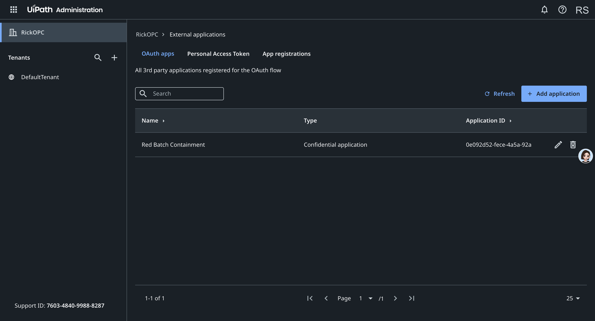

# Red Batch

**A safety complaint about a bad product lot becomes a human-approved stop-ship on the exact right
orders — with a saved, reopenable record to prove what happened.**

Red Batch is a governed product-safety **containment workspace** built for the **UiPath AgentHack — UiPath
Maestro Case** track. It implements the Maestro Case shape end-to-end: a durable case, a coded agent that
does the work through governed actions, a **real human approval on the state-changing step (a live UiPath
Action Center task)**, explicit state mutation, verification, and a reopenable outcome artifact.

| | |
|---|---|
| **Live app** | https://red-batch.veithly.workers.dev (Cloudflare Workers + D1, running in UiPath **cloud mode**) |
| **Demo video** | https://youtu.be/tABpObnVRIs (3:19) |
| **Repository** | https://github.com/veithly/red-batch |
| **UiPath environment (built here)** | https://cloud.uipath.com/rickopc/DefaultTenant — opens to an empty-looking dashboard on the Community plan; see [Where to see the UiPath usage](#where-to-see-the-uipath-usage) |
| **Pitch deck** | [`docs/red-batch-deck.pdf`](docs/red-batch-deck.pdf) |

---

## Project Description

**The problem.** When a product-safety complaint lands on a manufacturing lot you might *still be
shipping*, you have minutes, not days. The usual options are both bad: **freeze the whole warehouse** and
break shipping for everyone, or **chase orders by hand** in a spreadsheet while defective units keep going
out the door. There is no fast, governed way to hold *exactly the right orders* — with a human sign-off and
an auditable record of what changed and why.

**What Red Batch does.** It turns that scramble into one governed action:

1. **Observe** — a product-safety signal arrives on a lot (case `RB-2049`: battery overheating,
   confidence 0.92).
2. **Trace & fan out** — the **Batch Containment Agent** maps the lot to its SKU and warehouse and finds
   every *Ready-to-Ship* order in scope (**37 to hold, 11 excluded** with a specific reason each).
3. **Human approval (the governance line)** — nothing changes until a QA manager approves. In cloud mode
   that approval is a **real UiPath Action Center task** with an inspectable task id.
4. **Mutate & verify** — on approval, 37 order rows move `Ready to Ship → Quarantined - QA Review`
   (≈ **$360,480** held across 3 zones), and the agent **verifies the change by reading it back (37 of 37)**.
5. **Prove it** — a **Final Stop-Ship Packet** is saved with the before/after diff, evidence, the named
   approver, and the exclusions. It is **reopenable by order, lot, case, or packet id**.

A second case (`RB-7712`, confidence 0.54) shows the **recovery path**: below the 0.70 action floor the
agent refuses to act alone, routes to *Human Review Required*, proposes a partial 5-order hold, and opens
an evidence task. Every step writes a **governed run** and a **timeline event**, so the whole thing is
auditable.

---

## UiPath Components

This solution is built on the **UiPath Maestro Case** pattern and integrates **live** with the UiPath
platform. The components used:

| Component | How Red Batch uses it |
|---|---|
| **UiPath Automation Cloud** (Community) | The org/tenant the solution was built and runs against: `https://cloud.uipath.com/rickopc/DefaultTenant`. |
| **UiPath Action Center** — Tasks / Actions (`OR.Tasks`) | **The live, exercised integration.** The QA human-approval checkpoint is a real Action Center task: the agent calls `CreateTask` (Generic/External task) when it stops at the human gate, and completing the approval calls `CompleteTask` — a genuine platform action with an inspectable task id, *before* any order state changes. |
| **UiPath Orchestrator** — REST / OData API | Folders + Jobs APIs. `StartJobs` (`OR.Jobs`/`OR.Execution`) is wired for a published-process / unattended-robot environment; the Community plan does not provide an unattended robot, so the **live, exercised** platform action is the Action Center task above. |
| **UiPath External Applications** | OAuth 2.0 **client-credentials** application ("Red Batch Containment", Confidential) that authenticates every API call with scopes `OR.Tasks OR.Folders OR.Jobs OR.Execution`. |
| **UiPath Maestro Case** (track / pattern) | The end-to-end shape the app implements: durable case → governed actions → human approval task → state mutation → verification → exception handling → saved, reopenable artifact. |

The adapter that drives all of the above is `app/lib/uipath/orchestrator.ts`. When `UIPATH_*` credentials
are present it runs in **cloud mode** against the live tenant; without them it falls back to an honest,
clearly-labeled **local-governed** record and **never fakes a cloud call**.

### Where to see the UiPath usage

Opening the tenant URL lands on a near-empty Orchestrator dashboard, which can read as "nothing here." That
is a **Community-plan UI limitation, not a missing integration** — the plan does not expose an **Action
Center** UI, the **Maestro** canvas is empty until a process is published from Studio, and there is **no
unattended robot** to show job runs. The integration Red Batch actually uses is the **Action Center Tasks
API**, whose task store is reachable by API but has **no dashboard surface** on this plan. Here is where the
genuine, verifiable usage lives:

1. **Admin → External Applications → "Red Batch Containment"** *(visible in the tenant)* — the Confidential
   OAuth 2.0 client-credentials app, scopes `OR.Tasks OR.Folders OR.Jobs OR.Execution`, that authenticates
   every call. This is the one piece the Community UI does render:

   

2. **The live app's Governance panel** at https://red-batch.veithly.workers.dev shows
   `Mode: Automation Cloud — configured for DefaultTenant` and a real **`UIPATH-TASK-…`** with a *View in
   UiPath Action Center* deep link, proving the deployed app holds working tenant credentials.
3. **Reproducible API proof** — with the same credentials, the agent's approval checkpoint calls
   `POST orchestrator_/tasks/GenericTasks/CreateTask` and gets back a real task (HTTP **201**, e.g.
   task **#4397163**), confirmed by `GetTaskDataById` (HTTP **200**). The OAuth token + Orchestrator
   `Folders` read are reproducible with `node scripts/uipath-smoke.mjs` (prints `TOKEN_OK`, `FOLDERS 200`,
   folder `Shared`).

In short: the tasks are **created live in the tenant** at the human-approval line; the Community plan simply
has no screen to list them. A tenant with Action Center / an unattended robot would surface them in the UI
with no code change. **Full evidence with screenshots: [`docs/uipath-proof.md`](docs/uipath-proof.md).**

---

## Agent Type

**Coded Agent.** Red Batch's Batch Containment Agent is a **custom-coded agent written in TypeScript**
(`app/lib/agent/containmentAgent.ts`) driving a deterministic policy (`app/lib/policy.ts`). It is **not** a
low-code / Agent Builder agent. It integrates with the UiPath platform through the **Orchestrator / Action
Center REST API** for the governed human-in-the-loop checkpoint.

- The agent's containment decisions (match, scope, exclusions, the confidence/severity gate) are
  **deterministic code**, not a model guess.
- An **optional, additive LLM** (`app/lib/llm.ts`, any OpenAI-compatible endpoint) only *narrates* the
  agent's reasoning. It never decides matching, approval, mutation, or verification, and the app works
  fully with it disabled.

> Summary for judging: **Coded Agent** + **live UiPath Action Center governance** (Coded, not Low-code).

---

## Try it (live, no setup)

The fastest way to evaluate is the deployed app — it runs in **UiPath cloud mode**, so the approval really
opens an Action Center task:

1. Open **https://red-batch.veithly.workers.dev** and pick a role on the entry screen.
2. Open case **RB-2049** → click **Run Containment** → review the 37-hold / 11-exclude plan.
3. **Approve** the stop-ship at the QA checkpoint (this creates + completes the Action Center task).
4. Open the saved **Stop-Ship Packet** (`/packets/RB-PKT-2049`) — the diff, evidence, approver, exclusions.
5. **Reopen path:** go to `/reopen`, search `O-1042`, and trace the order back to the case that froze it.
6. **Recovery path:** open case **RB-7712** and Run Containment to see the low-confidence → human-review route.

> The Cloudflare/D1 deployment code lives on the [`deploy/cloudflare`](https://github.com/veithly/red-batch/tree/deploy/cloudflare)
> branch. `main` (this branch) keeps the zero-setup `node:sqlite` build for the easiest local run.

---

## Setup Instructions (run it for judging)

### Option A — Use the live app (recommended, zero setup)

Open **https://red-batch.veithly.workers.dev** and follow the **Try it** steps above. It is already running
in UiPath cloud mode.

### Option B — Run locally (this `main` branch, zero external services)

**Prerequisites:** **Node.js 22 or newer** (developed on Node 26). The local store uses Node's built-in
`node:sqlite`, so no database to install.

```bash
git clone https://github.com/veithly/red-batch.git
cd red-batch
npm install
npm run build
npm run start          # serves http://localhost:4387
```

Then open **http://localhost:4387** and follow the **Try it** demo path. Optional verification:

```bash
npm run smoke          # runs the full containment loop end-to-end, prints 14 checks
node scripts/db-stats.mjs   # prints row counts in the persisted store
```

Out of the box (no credentials) the app runs in **local-governed mode**: every governance step is recorded
and clearly labeled, but no external call is made.

### Option C — Run locally in UiPath cloud mode (live Action Center tasks)

To make the approval step a **real UiPath Action Center task**, provide credentials from a UiPath
Automation Cloud tenant. Create `.env.local` in the project root:

```bash
# UiPath (required for cloud mode)
UIPATH_ORG_URL=https://cloud.uipath.com/<your-org>
UIPATH_TENANT_NAME=<your-tenant>          # e.g. DefaultTenant
UIPATH_CLIENT_ID=<external-app-app-id>
UIPATH_CLIENT_SECRET=<external-app-secret>
UIPATH_FOLDER_ID=<orchestrator-folder-id>

# Optional LLM narration (any OpenAI-compatible endpoint)
OPENAI_API_KEY=<key>
OPENAI_BASE_URL=https://api.openai.com/v1
OPENAI_DEFAULT_MODEL=gpt-4o-mini
```

**How to get the UiPath values:**

1. In **Automation Cloud → Admin → External Applications → Add Application**, create a **Confidential**
   application. Under *Application Scopes → Orchestrator API Access*, add **`OR.Tasks`, `OR.Folders`,
   `OR.Jobs`, `OR.Execution`**. Save and copy the **App ID** (`UIPATH_CLIENT_ID`) and **App Secret**
   (`UIPATH_CLIENT_SECRET`).
2. `UIPATH_ORG_URL` is `https://cloud.uipath.com/<your-org>`; `UIPATH_TENANT_NAME` is your tenant name.
3. `UIPATH_FOLDER_ID`: in **Orchestrator → Tenant → Folders**, open your folder and copy its numeric id.

Then `npm run build && npm run start`. The home screen's Governance/Integration status will show
`uipath: cloud — connected`, and approving `RB-2049` will create and complete a real Action Center task.

### Option D — Deploy to Cloudflare (the live URL above)

The `deploy/cloudflare` branch ports the data layer to **Cloudflare D1** and deploys via **OpenNext**:

```bash
git checkout deploy/cloudflare
npm install
npx wrangler login
npx wrangler d1 create red-batch                 # then set database_id in wrangler.jsonc
npm run db:migrate:remote                         # applies migrations/0001_init.sql
npx wrangler secret bulk .dev.vars                # UIPATH_* + OPENAI_* secrets (not committed)
npm run cf:deploy                                 # OpenNext build + deploy to Workers
```

See that branch's `README.md` for the full Cloudflare/D1 details.

---

## How it works

- **Real persisted state.** On `main`, a `node:sqlite` file store at `.data/redbatch.sqlite`; on
  `deploy/cloudflare`, a Cloudflare **D1** database. Cases, orders, approvals, packets, timeline, and
  governed runs are **real rows that survive a restart**. The schema is Postgres-portable.
- **The agent loop** (`app/lib/agent/containmentAgent.ts`): observe the signal → map lot to SKU and
  warehouse → fan out to affected orders → classify exclusions → gate on QA approval → mutate order state →
  verify by reading it back → save the packet. Every step writes a governed run and a timeline event.
- **The decision** (`app/lib/policy.ts`): confidence vs. an action threshold + severity decides full
  stop-ship vs. human review. Deterministic, not a model guess.
- **UiPath governance** (`app/lib/uipath/orchestrator.ts`): records each Maestro-Case step; in cloud mode
  the approval becomes a live Action Center task (`createApprovalTask` → `completeApprovalTask`);
  `startCloudProcess` is wired for a published-process environment.
- **LLM narration** (`app/lib/llm.ts`): optional and additive, with a deterministic fallback.

### Key implementation files

- `app/lib/agent/containmentAgent.ts` — the containment loop and verification.
- `app/lib/policy.ts` — the deterministic containment decision.
- `app/lib/uipath/orchestrator.ts` — UiPath governance adapter (cloud Action Center tasks + local-governed
  fallback): `createApprovalTask`, `completeApprovalTask`, `startCloudProcess`.
- `app/lib/repo.ts`, `app/lib/db/client.ts` — the owned store and schema.
- `app/components/CaseWorkbench.tsx` — the case workbench UI and its stages.
- `app/packets/[code]/page.tsx` — the Stop-Ship Packet artifact.

## Limits and honest failures

- With UiPath credentials the demo runs in **cloud mode** against a live Automation Cloud tenant, and the
  approval step is a real Action Center task with an inspectable task id. The live proof is the
  human-checkpoint task (`OR.Tasks`), **not** a published-process unattended robot run: a full `StartJobs`
  run needs a published process and an unattended robot, which a Community plan does not provide. The
  `startCloudProcess` path is wired for an environment that has them. Without credentials the app falls back
  to a clearly labeled local-governed record and **never fakes a cloud call**.
- The store is `node:sqlite` (main) / Cloudflare D1 (deploy) because no managed Postgres URL was available.
  It is real and persistent; the schema is Postgres-portable.

## License

MIT (see `LICENSE`).
