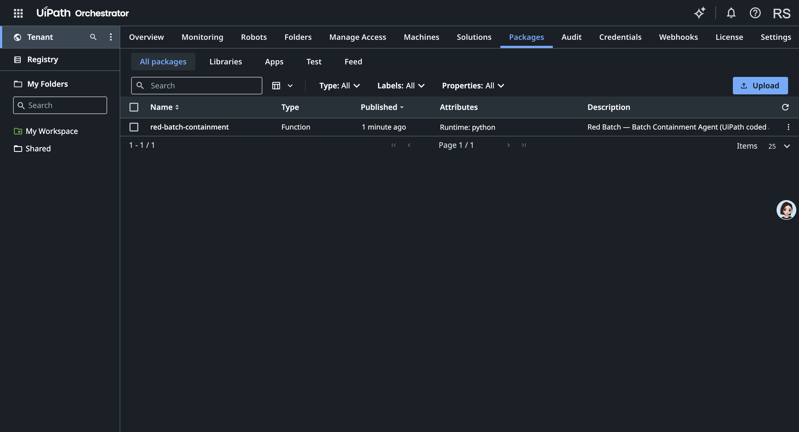

# Red Batch — Cloudflare (D1) deployment branch

**A safety complaint about a bad product lot becomes a human-approved stop-ship on the exact right
orders — with a saved, reopenable record to prove what happened.**

> This is the **`deploy/cloudflare`** branch: the app ported to **Cloudflare Workers + D1** via OpenNext.
> The `main` branch keeps the zero-setup `node:sqlite` build for an easy local run. Both share one schema
> and the same product.

Red Batch is a governed product-safety **containment workspace** built for the **UiPath AgentHack — UiPath
Maestro Case** track. It implements the Maestro Case shape end-to-end: a durable case, a coded agent that
does the work through governed actions, a **real human approval on the state-changing step (a live UiPath
Action Center task)**, explicit state mutation, verification, and a reopenable outcome artifact.

| | |
|---|---|
| **Live app** | https://red-batch.veithly.workers.dev (Cloudflare Workers + D1, running in UiPath **cloud mode**) |
| **Demo video** | https://youtu.be/tABpObnVRIs (3:19) |
| **Repository** | https://github.com/veithly/red-batch |
| **UiPath environment (built here)** | https://cloud.uipath.com/rickopc/DefaultTenant — opens to an empty-looking dashboard on the Community plan; see [Where to see the UiPath usage](#where-to-see-the-uipath-usage) |
| **Pitch deck** | [`docs/red-batch-deck.pdf`](docs/red-batch-deck.pdf) |

---

## Project Description

**The problem.** When a product-safety complaint lands on a manufacturing lot you might *still be
shipping*, you have minutes, not days. The usual options are both bad: **freeze the whole warehouse** and
break shipping for everyone, or **chase orders by hand** in a spreadsheet while defective units keep going
out. There is no fast, governed way to hold *exactly the right orders* — with a human sign-off and an
auditable record of what changed and why.

**What Red Batch does.** It turns that scramble into one governed action:

1. **Observe** — a product-safety signal arrives on a lot (case `RB-2049`: battery overheating,
   confidence 0.92).
2. **Trace & fan out** — the **Batch Containment Agent** maps the lot to its SKU and warehouse and finds
   every *Ready-to-Ship* order in scope (**37 to hold, 11 excluded** with a specific reason each).
3. **Human approval (the governance line)** — nothing changes until a QA manager approves. In cloud mode
   that approval is a **real UiPath Action Center task** with an inspectable task id.
4. **Mutate & verify** — on approval, 37 order rows move `Ready to Ship → Quarantined - QA Review`
   (≈ **$360,480** held across 3 zones), and the agent **verifies the change by reading it back (37 of 37)**.
5. **Prove it** — a **Final Stop-Ship Packet** is saved with the before/after diff, evidence, the named
   approver, and the exclusions. It is **reopenable by order, lot, case, or packet id**.

A second case (`RB-7712`, confidence 0.54) shows the **recovery path**: below the 0.70 action floor the
agent refuses to act alone, routes to *Human Review Required*, proposes a partial 5-order hold, and opens an
evidence task. Every step writes a **governed run** and a **timeline event**.

---

## UiPath Components

Built on the **UiPath Maestro Case** pattern and integrated **live** with the UiPath platform:

| Component | How Red Batch uses it |
|---|---|
| **UiPath Automation Cloud** (Community) | The org/tenant the solution was built and runs against: `https://cloud.uipath.com/rickopc/DefaultTenant`. |
| **UiPath Coded Agent** + **UiPath CLI** | The containment policy is also packaged as a Python **coded agent** ([`uipath-agent/`](uipath-agent)) and **published to the tenant** with the UiPath CLI (`uipath auth` → `pack` → `publish -t`). It is visible under **Orchestrator → Tenant → Packages** as `red-batch-containment` (Type: Function). |
| **UiPath Action Center** — Tasks / Actions (`OR.Tasks`) | **The live, exercised integration.** The QA human-approval checkpoint is a real Action Center task: the agent calls `CreateTask` when it stops at the human gate and `CompleteTask` on approval — a genuine platform action with an inspectable task id, *before* any order state changes. |
| **UiPath Orchestrator** — REST / OData API | Folders + Jobs APIs. `StartJobs` (`OR.Jobs`/`OR.Execution`) is wired for a published-process / unattended-robot environment (not available on Community). |
| **UiPath External Applications** | OAuth 2.0 **client-credentials** application that authenticates every API call with scopes `OR.Tasks OR.Folders OR.Jobs OR.Execution`. |
| **UiPath Maestro Case** (track / pattern) | The end-to-end shape the app implements: durable case → governed actions → human approval task → state mutation → verification → exception handling → saved, reopenable artifact. |

The adapter that drives all of the above is `app/lib/uipath/orchestrator.ts`. With `UIPATH_*` credentials it
runs in **cloud mode** against the live tenant; without them it falls back to an honest, clearly-labeled
**local-governed** record and **never fakes a cloud call**.

### Where to see the UiPath usage

The tenant's Orchestrator dashboard can read as "nothing here" because the **Community plan** does not expose
an **Action Center** UI, the **Maestro** canvas is empty until a process is published from Studio, and there
is **no unattended robot** to show job runs. That is a UI limitation, not a missing integration. Here is the
genuine, verifiable usage — including a coded agent published into the tenant:

1. **Orchestrator → Tenant → Packages → `red-batch-containment`** *(visible in the tenant)* — the containment
   policy published as a UiPath **coded agent** (Type: Function, runtime python) with the
   [UiPath CLI](https://docs.uipath.com/uipath-cli) (`uipath auth` → `pack` → `publish -t`). Source in
   [`uipath-agent/`](uipath-agent):

   

2. **Admin → External Applications → "Red Batch Containment"** *(visible in the tenant)* — the Confidential
   OAuth 2.0 client-credentials app, scopes `OR.Tasks OR.Folders OR.Jobs OR.Execution`, that authenticates
   every call:

   

3. **The live app's Governance panel** at https://red-batch.veithly.workers.dev shows
   `Mode: Automation Cloud — configured for DefaultTenant` and a real **`UIPATH-TASK-…`** with a *View in
   UiPath Action Center* deep link, proving the deployed app holds working tenant credentials.
4. **Reproducible API proof** — with the same credentials, the agent's approval checkpoint calls
   `POST orchestrator_/tasks/GenericTasks/CreateTask` and gets back a real task (HTTP **201**, e.g.
   task **#4397163**), confirmed by `GetTaskDataById` (HTTP **200**). The OAuth token + Orchestrator
   `Folders` read are reproducible with `node scripts/uipath-smoke.mjs` (prints `TOKEN_OK`, `FOLDERS 200`,
   folder `Shared`).

The human-approval tasks are **created live in the tenant**; the Community plan simply has no screen to list
them. **Full evidence with screenshots: [`docs/uipath-proof.md`](docs/uipath-proof.md).**

---

## Agent Type

**Coded Agent.** Red Batch's Batch Containment Agent is a **custom-coded agent written in TypeScript**
(`app/lib/agent/containmentAgent.ts`) driving a deterministic policy (`app/lib/policy.ts`). It is **not** a
low-code / Agent Builder agent. It integrates with the UiPath platform through the **Orchestrator / Action
Center REST API** for the governed human-in-the-loop checkpoint. The same policy is additionally **published
to UiPath as a Python coded agent** ([`uipath-agent/`](uipath-agent), via `uipath pack` / `uipath publish`),
so it exists as a real coded-agent package in the tenant (Orchestrator → Tenant → Packages). An **optional,
additive LLM** (`app/lib/llm.ts`) only *narrates* the agent's reasoning and never decides matching, approval,
mutation, or verification.

---

## Setup Instructions (run it for judging)

### Option A — Use the live app (recommended, zero setup)

Open **https://red-batch.veithly.workers.dev**, pick a role, open case **RB-2049** → **Run Containment** →
**Approve** (this creates + completes a real UiPath Action Center task) → open the **Stop-Ship Packet**
(`/packets/RB-PKT-2049`). Reopen path: `/reopen`, search `O-1042`. Recovery path: open **RB-7712**.

### Option B — Run this D1 branch locally

**Prerequisites:** Node.js 22+ and a Cloudflare account (`npx wrangler login`). This branch stores state in
Cloudflare **D1**; local dev uses a local D1 (Miniflare) via OpenNext.

```bash
git clone -b deploy/cloudflare https://github.com/veithly/red-batch.git
cd red-batch
npm install
npm run db:migrate:local        # apply migrations/0001_init.sql to the local D1
npm run dev                      # Next dev with the local D1 binding (http://localhost:4387)
# or a production-like local preview on Workers runtime:
npm run cf:preview
```

For **cloud mode** locally (real UiPath Action Center tasks + LLM narration), put `UIPATH_*` and `OPENAI_*`
in a gitignored `.dev.vars` (see `.dev.vars` keys below).

> Prefer a zero-dependency local run? Use the **`main`** branch instead: `npm install && npm run build &&
> npm run start` (it uses Node's built-in `node:sqlite`, no Cloudflare account needed).

### Option C — Deploy to Cloudflare (the live URL above)

```bash
npx wrangler login
npx wrangler d1 create red-batch        # put the returned database_id in wrangler.jsonc
npm run db:migrate:remote               # apply migrations/0001_init.sql to remote D1
npx wrangler secret bulk .dev.vars      # UIPATH_* + OPENAI_* secrets (not committed) → cloud mode
npm run cf:deploy                       # OpenNext build + deploy to Workers
```

The workspace auto-seeds on first request; the entry-screen "Reset demo workspace" reseeds it.

**`.dev.vars` / worker-secret keys** (for cloud mode):

```bash
UIPATH_ORG_URL=https://cloud.uipath.com/<your-org>
UIPATH_TENANT_NAME=<your-tenant>          # e.g. DefaultTenant
UIPATH_CLIENT_ID=<external-app-app-id>
UIPATH_CLIENT_SECRET=<external-app-secret>
UIPATH_FOLDER_ID=<orchestrator-folder-id>
OPENAI_API_KEY=<key>                       # optional, additive narration
OPENAI_BASE_URL=https://api.openai.com/v1
OPENAI_DEFAULT_MODEL=gpt-4o-mini
```

Create the UiPath values in **Automation Cloud → Admin → External Applications → Add Application**
(Confidential), with *Orchestrator API Access* scopes `OR.Tasks OR.Folders OR.Jobs OR.Execution`; the
folder id comes from **Orchestrator → Tenant → Folders**.

---

## How it works

- **Real persisted state:** **Cloudflare D1** (managed SQLite) bound as `DB` and accessed through the async
  helpers in `app/lib/db/client.ts`; the schema lives in `migrations/0001_init.sql`. Cases, orders,
  approvals, packets, timeline, and governed runs are real rows that survive a restart. (The `main` branch
  uses `node:sqlite` for a zero-setup local run; this branch ports the same schema to D1.)
- **The agent loop** (`app/lib/agent/containmentAgent.ts`): observe → map lot to SKU/warehouse → fan out →
  classify exclusions → gate on QA approval → mutate order state → verify by read-back → save the packet.
- **The decision** (`app/lib/policy.ts`): confidence vs. threshold + severity decides stop-ship vs. human
  review. Deterministic, not a model guess.
- **UiPath governance** (`app/lib/uipath/orchestrator.ts`): records each Maestro-Case step; in cloud mode
  the approval becomes a live Action Center task (`createApprovalTask` → `completeApprovalTask`).
- **LLM narration** (`app/lib/llm.ts`): optional and additive, with a deterministic fallback.

### Key implementation files

- `app/lib/agent/containmentAgent.ts` — the containment loop and verification.
- `app/lib/policy.ts` — the deterministic containment decision.
- `app/lib/uipath/orchestrator.ts` — UiPath governance adapter (cloud Action Center tasks + local-governed
  fallback): `createApprovalTask`, `completeApprovalTask`, `startCloudProcess`.
- `app/lib/repo.ts`, `app/lib/db/client.ts` — the owned store (async D1 query layer).
- `migrations/0001_init.sql`, `wrangler.jsonc`, `open-next.config.ts` — the Cloudflare D1 + OpenNext deploy.
- `app/components/CaseWorkbench.tsx` — the case workbench UI and its stages.
- `app/packets/[code]/page.tsx` — the Stop-Ship Packet artifact.

## Limits and honest failures

- With UiPath credentials the demo runs in **cloud mode** against a live Automation Cloud tenant, and the
  approval step is a real Action Center task with an inspectable task id. The live proof is the
  human-checkpoint task (`OR.Tasks`), **not** a published-process unattended robot run (a full `StartJobs`
  run needs a published process and an unattended robot, which a Community plan does not provide). Without
  credentials the app falls back to a clearly labeled local-governed record and **never fakes a cloud call**.
- The store is Cloudflare D1 (managed SQLite) on the live deployment; `main` uses `node:sqlite` for a
  zero-setup local run. Both are real and persistent and share one schema.

## License

MIT (see `LICENSE`).
