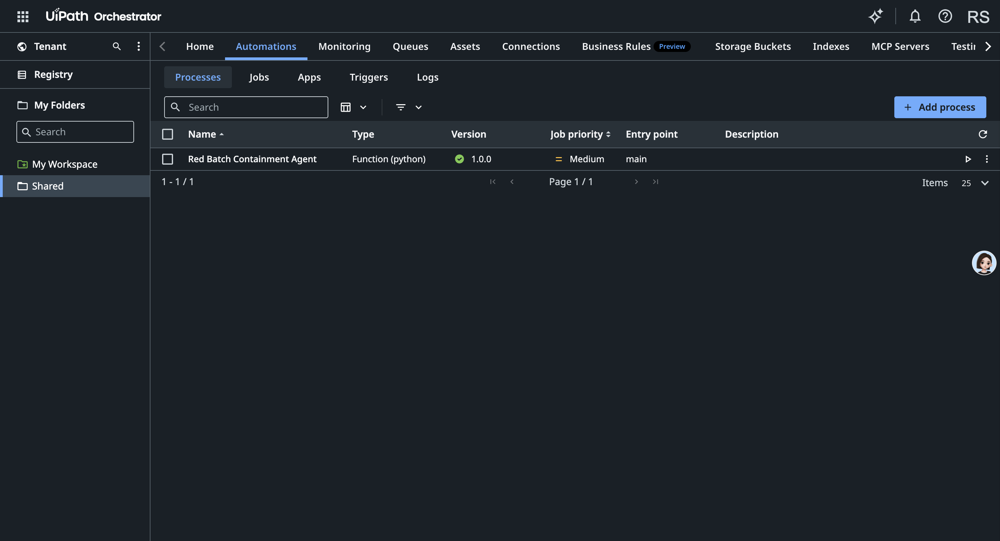

# UiPath usage — proof of the live integration

Red Batch integrates **live** with UiPath Automation Cloud (org `rickopc`, tenant `DefaultTenant`). The
tenant's Orchestrator dashboard looks empty because the **Community plan does not expose an Action Center
UI**, the **Maestro** canvas is empty until a process is published from Studio, and there is **no unattended
robot** to show job runs. The integration the app actually uses is the **Action Center Tasks API**, whose
task store is reachable by API but has no dashboard surface on this plan. This page shows where the genuine,
verifiable usage lives.

## 1. A coded agent published to the tenant (visible in Orchestrator)

The Red Batch containment policy is also published to the tenant as a **UiPath coded agent** using the
[UiPath CLI](https://docs.uipath.com/uipath-cli) (`uipath auth` with the External Application →
`uipath pack` → `uipath publish -t`). It is visible under **Orchestrator → Tenant → Packages** as
`red-batch-containment` (Type: **Function**, Runtime: **python**). Source: [`../uipath-agent/`](../uipath-agent).


It is also deployed as a runnable **Process** in the **Shared** folder (Automations → Processes), Type
**Function (python)**, version **1.0.0**, entry point `main`:



It runs and returns the project's reference numbers:

```
$ uipath run main '{"case_code":"RB-2049","lot_id":"LOT-7741","sku":"SKU-RED-7741","warehouse":"WH-APAC-3","confidence":0.92,"ready_to_ship_orders":48,"out_of_scope_orders":11}'
output
├── case_code: RB-2049
├── decision: stop_ship_full
├── orders_to_hold: 37
├── orders_excluded: 11
├── est_value_held: 360491.0
├── zones: 3
├── requires_approval: True
└── rationale: Confidence 0.92 >= floor 0.70: scope a full stop-ship ... requires a human QA approval (UiPath Action Center task) ...
✓  Successful execution.
```

## 2. External Application registered in the tenant (visible in Admin)

`Admin → External applications → OAuth apps → **Red Batch Containment**` — a **Confidential application**
(OAuth 2.0 client-credentials, Application ID `0e092d52-fece-4a5a-92a…`) with Orchestrator scopes
`OR.Tasks OR.Folders OR.Jobs OR.Execution`. Every API call below authenticates through this app.


## 3. The deployed app runs in UiPath cloud mode

The live app's **Governance proof — UiPath Cloud** panel shows the Maestro-Case steps executed against the
tenant, including a real **QA Approval Task `UIPATH-TASK-4392284`** with a *View in UiPath Action Center*
deep link, and `Mode: Automation Cloud — configured for DefaultTenant`.


## 4. Reproducible API proof (any judge with the credentials)

OAuth token + Orchestrator read (`node scripts/uipath-smoke.mjs`):

```
TOKEN_OK len= 964
FOLDERS 200
  folder: 7988050 Shared
RELEASES 200   release_count: 0
```

Live human-approval task create + read (the exact call the agent makes at the approval line —
`POST orchestrator_/tasks/GenericTasks/CreateTask`, type `ExternalTask`):

```
CREATE 201   { "data": { "caseCode":"CASE-DEMO-…","ordersToHold":37,"excluded":11,"estValue":360480 }, ... }
NEW_TASK_ID  4397163
GET 200      title: "Approve stop-ship hold — … (37 orders, ~$360,480)"   status: 0 (Pending)   priority: High
```

`HTTP 201 Created` + `HTTP 200` on read-back is conclusive: the task is created **in the tenant**, live, at
the human-approval checkpoint. `odata/Tasks` returns `count=0` for the same Community-plan reason — the
Generic/External task store has no listing surface on this plan. A tenant with Action Center (or an
unattended robot for `StartJobs`) would render these in the UI with **no code change**.

## Where this is wired in the code

- `app/lib/uipath/orchestrator.ts` — `getCloudToken()`, `createApprovalTask()` → `CreateTask`,
  `completeApprovalTask()` → `CompleteTask`, `startCloudProcess()` → `StartJobs`.
- `app/lib/agent/containmentAgent.ts` — calls the approval task at the governed human checkpoint.
- `scripts/uipath-smoke.mjs` — the reproducible token + Folders/Releases read shown above.
